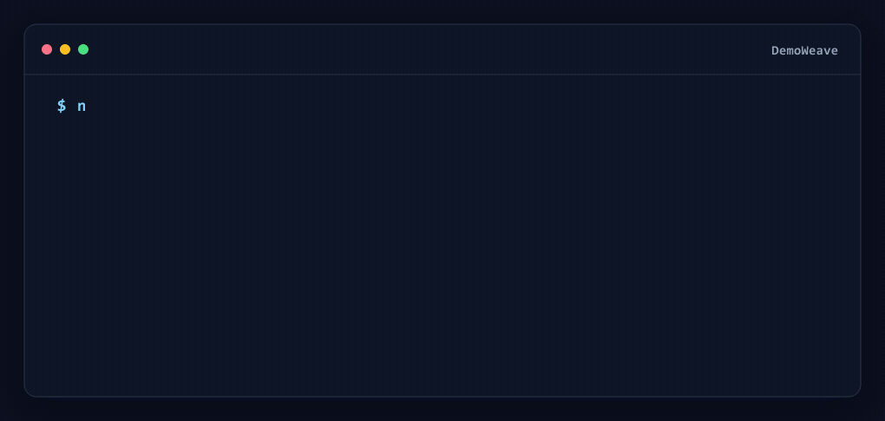
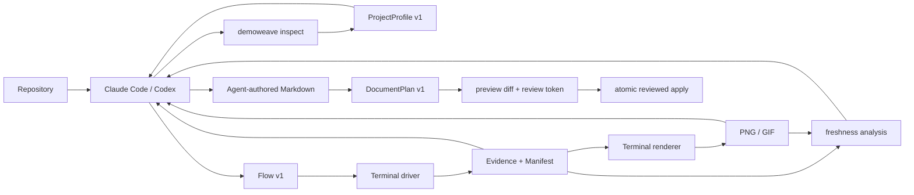

# DemoWeave

**Runtime evidence for agent-authored software documentation.**

DemoWeave helps Claude Code, Codex, and other coding agents ground documentation in verified repository facts and captured runtime behavior. The agent decides what to explain and writes the document; DemoWeave inspects the repository, executes declared workflows, records evidence with provenance, renders terminal media, explains when that evidence becomes stale, and safely previews/applies reviewed Markdown changes.



*DemoWeave inspecting DemoWeave: the committed `inspect-project` Flow ran the built CLI, captured terminal evidence, and rendered this GIF. It demonstrates the current evidence pipeline—not automatic README generation.*

## Why DemoWeave

Many AI documentation workflows stop at:

```text
source code → LLM → Markdown
```

DemoWeave adds deterministic execution, freshness, and review boundaries:

```text
understand → run → capture evidence → render → check freshness → write → preview diff → reviewed apply
```

The result is a shared workflow in which an agent supplies reasoning and writing while DemoWeave supplies deterministic inspection, execution, evidence, rendering, freshness analysis, safe patch review, validation, and provenance.

## What works today

| Capability | Status | Current scope |
|---|---|---|
| Repository analysis | Available | `ProjectProfile v1` with baseline Node, Python, Rust, and Go manifest analysis |
| Multi-surface model | Available | One profile can record multiple components, entrypoints, frameworks, and typed surfaces |
| Terminal workflows | Available | Non-interactive `Flow v1` execution with process runs, waits, assertions, and capture |
| Evidence and provenance | Available | `TerminalTrack v1`, `Evidence v1`, and `Manifest v1` with source fingerprints and derived relationships |
| Terminal rendering | Available | Headless PNG rendering; GIF rendering when FFmpeg is installed |
| Safe Markdown planning/patching | Available | `DocumentPlan v1`, section inspection, exact diff preview, review token, atomic apply/discard |
| Incremental stale tracking | Available | `FreshnessReport v1`, explainable stale chains, document impact, dry-run/minimal selective regeneration |
| Web, desktop, mobile, notebook, and research execution | Planned | Surface drivers are not implemented yet |
| Composed or narrated tutorials | Planned | Roadmap milestones M8–M10 |

Interactive PTY input, Playwright capture, native desktop/mobile automation, arbitrary GUI screenshots, and complete video/tutorial generation are outside the current implementation.

## How it works



The repository includes a [shared DemoWeave skill](skills/demoweave/SKILL.md) that gives coding agents the same platform-neutral workflow. It is a checked-in agent playbook, not a separately published Claude Code or Codex plugin.

## Quick start

DemoWeave is currently a source pnpm workspace, not a published npm package. Use it from a repository checkout.

Requirements: Node.js 20+, pnpm, and optionally FFmpeg for GIF rendering.

```bash
git clone https://github.com/KingHacker9000/demoweave.git
cd demoweave
pnpm install --frozen-lockfile
pnpm build

node packages/cli/dist/index.js doctor
node packages/cli/dist/index.js init .
node packages/cli/dist/index.js inspect .
node packages/cli/dist/index.js validate .
```

`inspect` writes the generated `.demoweave/project.json` profile. `init` creates the Flow, Evidence, and document-plan metadata directories. `validate` checks the profile, committed Flows, DocumentPlans, Evidence manifest, and cross-file bindings.

## Run the evidence dogfood workflow

This repository ships the Flow and source evidence used by the animation above:

```bash
node packages/cli/dist/index.js run inspect-project
node packages/cli/dist/index.js render inspect-project-terminal --format png
node packages/cli/dist/index.js render inspect-project-terminal --format gif
node packages/cli/dist/index.js validate .
```

The workflow produces or updates:

- `.demoweave/project.json` — generated repository facts
- `.demoweave/evidence/artifacts/inspect-project-terminal.terminal.json` — renderer-independent terminal capture
- `.demoweave/evidence/manifest.json` — Flow, Evidence, fingerprints, provenance, and derivation records
- `docs-media/inspect-project-terminal.png` and `.gif` — rendered documentation assets

Flows may declare project-relative `sources`. Successful execution fingerprints the Flow, declared source files, and captured artifact so later freshness checks can identify exactly what changed.

## Keep evidence fresh

M6 turns provenance into an explain-first update workflow. Check status before regenerating anything:

```bash
node packages/cli/dist/index.js status .
```

For each Evidence item, DemoWeave reports `fresh`, `stale`, `missing`, or `unknown`, with concrete reasons such as a changed source file, changed Flow, missing artifact, or stale upstream Evidence. Local Markdown links/images are mapped back to affected Evidence so the report can also identify impacted documents.

Preview the minimal regeneration plan without mutation:

```bash
node packages/cli/dist/index.js update .
```

Apply only that computed plan when wanted:

```bash
node packages/cli/dist/index.js update . --apply
```

A stale source Evidence item schedules one run of its producing Flow; affected PNG/GIF derivations are then selectively re-rendered. Unknown baselines are reported rather than guessed and are not automatically regenerated. If everything is fresh, `update --apply` executes zero actions, so unchanged evidence and documents are not churned.

Use `--json` with `status` or `update` for the structured `FreshnessReport v1`/update result.

## Safely patch Markdown

M5 adds a review boundary between agent-authored prose and file mutation. Inspect the target first:

```bash
node packages/cli/dist/index.js docs inspect README.md
node packages/cli/dist/index.js docs inspect README.md --json
```

The inspection provides the exact target SHA-256 hash and deterministic section IDs. The agent then writes a `DocumentPlan v1` under `.demoweave/plans/` using those IDs and one or more intentional operations: `preserve`, `edit`, `replace`, `create`, or reasoned `remove`.

Preview the complete candidate without touching the document:

```bash
node packages/cli/dist/index.js docs preview .demoweave/plans/readme.json
```

Preview prints the operation summary, unified diff, candidate hash, and deterministic `review-v1:...` token. After the diff is actually reviewed, apply exactly that candidate:

```bash
node packages/cli/dist/index.js docs apply .demoweave/plans/readme.json --review 'review-v1:<reviewed-token>'
```

Apply refuses stale target hashes, changed plans/candidates, conflicting operations, and mismatched review tokens. To abandon a plan without changing its target:

```bash
node packages/cli/dist/index.js docs discard .demoweave/plans/readme.json
```

The repository also contains a small committed M5 dogfood document/plan. CI previews and applies it in a disposable checkout, verifies stale re-application is rejected, and restores the document afterward.

Use `node packages/cli/dist/index.js --help` and `node packages/cli/dist/index.js docs --help` for the complete command list.

## Core concepts

- **ProjectProfile** — deterministic facts about components, ecosystems, manifests, workspaces, entrypoints, commands, docs, and surfaces.
- **Flow** — a surface-neutral sequence of semantic actions plus optional explicit source dependencies. The current terminal driver implements process runs, supported waits and assertions, and terminal capture.
- **Evidence** — a typed artifact record with lifecycle, producer, provenance, source/artifact fingerprints, and optional derivation metadata.
- **Manifest** — the project index that connects Flows to source and derived Evidence.
- **FreshnessReport** — an explainable view of Evidence freshness, impacted Markdown, and the minimal safe regeneration actions currently supported.
- **DocumentPlan** — an agent-authored, target-hash-bound set of intentional Markdown operations whose exact candidate must be previewed and fingerprinted before atomic apply.

The versioned JSON contracts live in [`schemas/`](schemas/).

## Project status

DemoWeave is in active development. **M0–M6 and Pilot P0 are complete:** the project can inspect multi-ecosystem repositories, execute/capture terminal Flows, render terminal PNG/GIF evidence, explain and selectively refresh stale evidence, dogfood those artifacts in its own README, and safely review/apply section-aware Markdown changes. **M7 is next**, adding the first browser surface driver with Playwright while preserving the existing Flow/Evidence contracts.

See [ROADMAP.md](ROADMAP.md) for milestone boundaries and future surface drivers. Browser automation, compositor/tutorial output, and desktop/mobile/research drivers remain unshipped until their milestones land.

## Development

```bash
pnpm build
pnpm test
pnpm typecheck
```

CI runs build, tests, typecheck, M6 stale/no-churn dogfood, terminal execution/rendering, and the reviewed M5 Markdown dogfood workflow on Ubuntu and Windows.

## License

[MIT](LICENSE)
