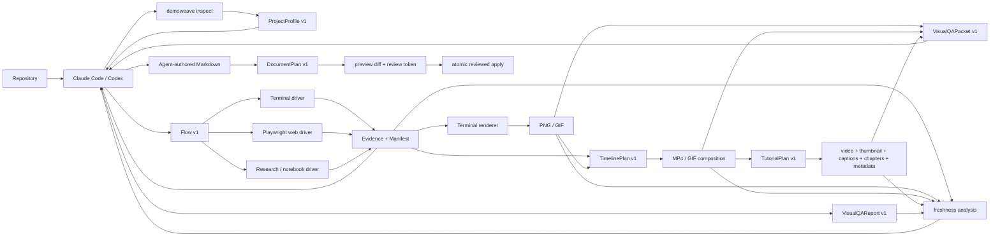

# DemoWeave

**Runtime evidence for agent-authored software documentation.**

DemoWeave helps Claude Code, Codex, and other coding agents ground documentation in verified repository facts and captured runtime behavior. The agent decides what to explain and writes the narrative; DemoWeave inspects the repository, executes declared terminal, browser, research, or notebook workflows, records evidence with provenance, renders and composes media, packages tutorial assets, prepares deterministic visual-review packets, explains when evidence becomes stale, and safely previews/applies reviewed Markdown changes.


*DemoWeave inspecting DemoWeave: the committed `inspect-project` Flow ran the built CLI, captured terminal evidence, and rendered this GIF. Browser capture uses the same Flow/Evidence contracts; browser interaction recording is not implemented yet.*

## Why DemoWeave

Many AI documentation workflows stop at:

```text
source code → LLM → Markdown
```

DemoWeave adds deterministic execution, evidence, freshness, presentation, visual review, and document-review boundaries:

```text
understand → run → capture evidence → render/compose → visually review → check freshness → write → preview diff → reviewed apply
```

The result is a shared workflow in which an agent supplies reasoning, writing, and visual judgment while DemoWeave supplies deterministic inspection, execution, evidence, rendering, composition, tutorial packaging, visual-review preparation/binding, freshness analysis, safe patch review, validation, and provenance.

## What works today

| Capability | Status | Current scope |
|---|---|---|
| Repository analysis | Available | `ProjectProfile v1` with baseline Node, Python, Rust, and Go manifest analysis |
| Multi-surface model | Available | One profile can record multiple components, entrypoints, frameworks, and typed surfaces |
| Terminal workflows | Available | Non-interactive `Flow v1` execution with process runs, waits, assertions, and terminal capture |
| Web workflows | Available | Headless Chromium through Playwright; semantic navigate/interact/wait/assert/scroll and PNG screenshot capture |
| Research / notebook workflows | Available | Explicit repository commands plus native plot/table/result/image/video/IPYNB artifact capture; no notebook-UI recording or environment guessing |
| Evidence and provenance | Available | `TerminalTrack v1`, screenshot/native/media `Evidence v1`, `Manifest v1`, source/Flow/artifact fingerprints, and derivation relationships |
| Terminal rendering | Available | Headless PNG rendering; GIF rendering when FFmpeg is installed |
| Timeline composition | Available | `TimelinePlan v1`; deterministic single/split scenes over local PNG/GIF Evidence/media; MP4/GIF output through FFmpeg |
| Tutorial packaging | Available | `TutorialPlan v1`; existing MP4 Evidence → packaged MP4, thumbnail, SRT/VTT, chapters, description, and YouTube-oriented JSON metadata |
| Visual QA | Available | Fresh PNG/GIF/MP4 Evidence → sampled frames/contact sheet/signals → agent-authored hash-bound PASS or NEEDS-CHANGES report |
| Safe Markdown planning/patching | Available | `DocumentPlan v1`, section inspection, exact diff preview, review token, atomic apply/discard |
| Incremental stale tracking | Available | `FreshnessReport v1`, explainable stale chains, document impact, dry-run/minimal selective regeneration |
| Desktop and mobile execution | Planned | Native desktop/mobile surface drivers are not implemented yet |
| Browser interaction recording | Planned | Web screenshot Evidence exists; composition does not pretend a static browser screenshot is browser video |
| Narration/TTS and publishing | Planned/optional | Tutorial packaging uses agent-authored captions/metadata; it does not synthesize narration or upload to a platform |

Interactive PTY input, browser video/GIF recording, native desktop/mobile automation, narration generation, automatic publishing, OCR-based secret detection, and automatic visual fixes are outside the current implementation.

## How it works



The repository includes a [shared DemoWeave skill](skills/demoweave/SKILL.md) that gives coding agents the same platform-neutral workflow. It is a checked-in agent playbook, not a separately published Claude Code or Codex plugin.

## Quick start

DemoWeave is currently a source pnpm workspace, not a published npm package. Use it from a repository checkout.

Requirements: Node.js 20+ and pnpm. FFmpeg is optional for core inspection, terminal capture, web screenshots, and native research artifact capture, but required for GIF rendering, timeline composition, tutorial thumbnail generation, and sampling animated media for visual QA. `ffprobe` is required for tutorial video validation and MP4 visual QA. Playwright Chromium is required only when executing web Flows. Research/notebook Flows use the explicit commands declared by the repository; DemoWeave does not install or guess a Python/Jupyter/R/Julia/MATLAB environment.

```bash
git clone https://github.com/KingHacker9000/demoweave.git
cd demoweave
pnpm install --frozen-lockfile
pnpm build

# Install only when browser workflows are needed.
pnpm --filter @demoweave/drivers exec playwright install chromium

node packages/cli/dist/index.js doctor
node packages/cli/dist/index.js init .
node packages/cli/dist/index.js inspect .
node packages/cli/dist/index.js validate .
```

On Linux, Playwright may also need its system browser dependencies; `playwright install --with-deps chromium` installs those on supported distributions. `doctor` reports whether Chromium, FFmpeg, and ffprobe are ready for the capabilities that use them.

`inspect` writes the generated `.demoweave/project.json` profile. `init` creates Flow, Evidence, document-plan, timeline, and tutorial metadata directories. `validate` checks the profile, committed Flows, DocumentPlans, TimelinePlans, TutorialPlans, Evidence manifest, and cross-file bindings without requiring FFmpeg just to parse metadata. Visual QA reports are strictly packet/source-bound by `qa finalize` before they become Evidence.

## Run a terminal evidence workflow

This repository ships the Flow and source evidence used by the animation above:

```bash
node packages/cli/dist/index.js run inspect-project
node packages/cli/dist/index.js render inspect-project-terminal --format png
node packages/cli/dist/index.js render inspect-project-terminal --format gif
node packages/cli/dist/index.js validate .
```

The workflow produces or updates:

- `.demoweave/project.json` — generated repository facts
- `.demoweave/evidence/artifacts/inspect-project-terminal.terminal.json` — renderer-independent terminal capture
- `.demoweave/evidence/manifest.json` — Flow, Evidence, fingerprints, provenance, and derivation records
- `docs-media/inspect-project-terminal.png` and `.gif` — rendered documentation assets

Flows may declare project-relative `sources`. Successful execution fingerprints the Flow, declared source files, and captured artifact so later freshness checks can identify exactly what changed.

## Run a web Flow

M7 implements the same `Flow v1` against `web` surfaces using Playwright Chromium. The application must already be running; DemoWeave does not guess or launch an arbitrary repository dev server.

For relative `navigate` destinations, pass the reachable origin at runtime:

```bash
node packages/cli/dist/index.js run <web-flow-id-or-path> \
  --base-url http://127.0.0.1:3000
```

Use `--headed` when you want to see Chromium during local debugging:

```bash
node packages/cli/dist/index.js run <web-flow-id-or-path> \
  --base-url http://127.0.0.1:3000 \
  --headed
```

The web driver currently implements the existing semantic Flow actions for navigation, activation, text input, key presses, scrolling, supported waits/assertions, and `capture` with `kind: "screenshot"`. Targets stay platform-neutral (`text`, `label`, `role`, `name`, `testId`, `accessibilityId`, or `automationId`); raw Playwright selectors do not belong in Flow v1.

Screenshot capture writes `.demoweave/evidence/artifacts/<evidence-id>.png`, records `driver/web` provenance in the manifest, and uses the same M6 Flow/source/artifact fingerprinting as terminal Evidence. Browser video/interaction GIF capture is intentionally not implemented yet.

For a complete committed browser dogfood example, see the [P1 web fixture](fixtures/web/README.md): DemoWeave detects the standalone Next.js app, executes a semantic `create-project` Flow, captures the real result as screenshot Evidence, links it from the fixture README, and proves stale-source → impacted-document → selective regeneration → no-churn behavior.

## Capture research and notebook outputs

M11 adds `ResearchDriver` for `research` and `notebook` surfaces. The agent declares the repository's real execution command in ordinary Flow `run` steps, then captures the files that command actually generated with `capture.artifact.path`. DemoWeave copies each project-local artifact into an immutable Evidence snapshot instead of recording notebook chrome.

The committed [research fixture](fixtures/research/README.md) proves a plot, benchmark table, metrics result, and executed notebook:

```bash
node packages/cli/dist/index.js inspect fixtures/research
node packages/cli/dist/index.js run research-results --project fixtures/research
node packages/cli/dist/index.js run notebook-results --project fixtures/research
node packages/cli/dist/index.js status fixtures/research
node packages/cli/dist/index.js validate fixtures/research
```

A native capture step looks like:

```json
{
  "id": "capture-metrics",
  "type": "capture",
  "evidenceId": "research-metrics",
  "kind": "result",
  "artifact": { "path": "outputs/metrics.json" }
}
```

Baseline artifact formats include PNG/JPEG/WebP/SVG/GIF/WebM/MP4, JSON/CSV/TXT/Markdown/HTML, and IPYNB. Use the Evidence `kind` that describes what the artifact means (`plot`, `table`, `result`, `image`, `recording`, etc.). Material code/config/data belongs in the Flow's explicit `sources`; disposable generated output paths are capture inputs, not source dependencies. The immutable Evidence bytes and Flow/source hashes are what freshness tracks.

DemoWeave does not infer a virtual environment, install Jupyter, or implement a hidden notebook runtime. A project can explicitly run `jupyter`, `uv`, `python`, `poetry`, R, Julia, MATLAB, a compiled binary, or any other repository-controlled command. The fixture uses a tiny dependency-free Node executor only so cross-platform CI can prove the `.ipynb` artifact contract without pretending that helper is Jupyter.

M11 uses the normal M6 update loop: if a declared research source changes, `demoweave update --apply` can rerun the producing Flow once. Cleaning a transient `outputs/` directory after capture does not stale the immutable Evidence snapshot, and a second update with nothing changed performs zero actions and no Evidence churn.

## Compose independent evidence

M8 adds `TimelinePlan v1` above the capture/render layers. A timeline describes presentation—not automation—and composes project-local Evidence/media without changing Flow v1 or requiring desktop recording.

This repository ships a real split-screen dogfood timeline that combines the animated terminal GIF with the static P1 browser screenshot:

```bash
node packages/cli/dist/index.js compose terminal-web-proof --format mp4
node packages/cli/dist/index.js compose terminal-web-proof --format gif
```

The compositor supports explicit canvas dimensions/FPS/background, ordered cut scenes, single or horizontal split layouts, padding/gap/ratio, and `contain`/`cover`. PNG inputs remain static; GIF inputs retain their real animation. FFmpeg receives argument arrays with `shell: false`; raw FFmpeg filter strings are not part of TimelinePlan v1.

The committed proof lives at `docs-media/terminal-web-proof.mp4` / `.gif`. Its browser pane is still a static screenshot. Composition does **not** imply browser interaction recording.

## Build a tutorial package

M9 introduces `TutorialPlan v1` for packaging existing MP4 Evidence. The agent authors the title, description, caption text/timing, chapter titles/timing, tags, and thumbnail treatment; DemoWeave validates those facts and deterministically produces the files.

The checked-in dogfood plan uses the M8 MP4 Evidence:

```bash
node packages/cli/dist/index.js tutorial build demoweave-overview --project .
```

By default it writes under `docs-media/tutorials/demoweave-overview/`:

- `demoweave-overview.mp4` — byte-preserved source MP4
- `demoweave-overview-thumbnail.png` — a real source frame plus deterministic SVG/resvg title treatment
- `demoweave-overview.srt` and `.vtt` — caption sidecars
- `demoweave-overview-chapters.txt` — upload-ready chapter timestamps
- `demoweave-overview-description.txt` — description plus chapters
- `demoweave-overview-youtube.json` — title/language/tags/file metadata

Each output is recorded as `renderer/tutorial` Evidence derived from the source MP4 and fingerprinted against its TutorialPlan. FFmpeg extracts the thumbnail frame; ffprobe validates source dimensions/duration and plan timing. DemoWeave does not synthesize narration, invent caption prose, upload the result, or transform a static browser screenshot into fake motion.

Use `--out-dir <project-relative-path>` when a different package directory is wanted.

## Review visual output

M10 keeps visual judgment with the coding agent while making the evidence being judged deterministic and hash-bound. Review only **fresh** PNG, GIF, or MP4 Evidence:

```bash
node packages/cli/dist/index.js qa prepare terminal-web-proof-mp4 \
  --project . \
  --samples 7
```

`qa prepare` creates generated review material under `.demoweave/cache/qa/<review-id>/`: sampled PNG frames, a contact sheet, and a `VisualQAPacket v1` containing the exact source hash, timestamps, dimensions, optional scene/caption context, and advisory black/freeze ranges. It also creates a pending durable template under `.demoweave/qa/reports/` if one does not already exist.

The agent opens the contact sheet and relevant frames, then edits the report with a `pass` or `needs-changes` verdict and structured findings such as readability, clipping, loading state, visible-secret risk, dead time, caption mismatch, composition, text overlap, or flicker. Black/freeze ranges are **signals, not automatic failures**; a deliberate final reading hold may be acceptable.

Finalize only after the actual samples were reviewed:

```bash
node packages/cli/dist/index.js qa finalize terminal-web-proof-mp4-review --project .
```

Finalization rechecks the exact packet hash, source Evidence/artifact hash, every sampled frame, contact sheet bytes, finding references, and timing. A changed source/packet must be prepared and reviewed again. PASS creates derived `agent/visual-qa` result Evidence and exits zero; NEEDS-CHANGES records the report but returns a failing gate exit status so CI/workflows can stop before publishing bad media.

DemoWeave does not silently run an external vision API, OCR secrets, or auto-fix visual findings. The agent is the reviewer; DemoWeave makes the review reproducible and provenance-aware.

## Keep evidence fresh

M6 turns provenance into an explain-first update workflow. Check status before regenerating or visually reviewing anything:

```bash
node packages/cli/dist/index.js status .
```

For each Evidence item, DemoWeave reports `fresh`, `stale`, `missing`, or `unknown`, with concrete reasons such as a changed source file, changed Flow/plan, missing artifact, or stale upstream Evidence. Local Markdown links/images are mapped back to affected Evidence so the report can also identify impacted documents.

Preview the minimal regeneration plan without mutation:

```bash
node packages/cli/dist/index.js update .
```

Apply only that computed plan when wanted:

```bash
node packages/cli/dist/index.js update . --apply
```

If a stale web Flow uses relative navigation, keep its application running and supply the runtime origin when applying the plan:

```bash
node packages/cli/dist/index.js update . --apply \
  --base-url http://127.0.0.1:3000
```

A stale source Evidence item schedules one run of its producing Flow when the required runtime context is available. Research/notebook Evidence uses that same surface-agnostic regeneration path; affected supported terminal derivations are selectively re-rendered. Compositor and tutorial outputs still participate in freshness propagation through `derivedFrom` and plan/file fingerprints, but the current minimal regeneration planner intentionally does not invent automatic compose/tutorial rebuild actions. Finalized QA reports derive from their reviewed source, so later source changes propagate stale state into the review record. Unknown baselines are reported rather than guessed. If everything is fresh, `update --apply` executes zero actions, so unchanged evidence and documents are not churned.

Use `--json` with `status` or `update` for the structured `FreshnessReport v1`/update result.

## Safely patch Markdown

M5 adds a review boundary between agent-authored prose and file mutation. Inspect the target first:

```bash
node packages/cli/dist/index.js docs inspect README.md
node packages/cli/dist/index.js docs inspect README.md --json
```

The inspection provides the exact target SHA-256 hash and deterministic section IDs. The agent then writes a `DocumentPlan v1` under `.demoweave/plans/` using those IDs and one or more intentional operations: `preserve`, `edit`, `replace`, `create`, or reasoned `remove`.

Preview the complete candidate without touching the document:

```bash
node packages/cli/dist/index.js docs preview .demoweave/plans/readme.json
```

Preview prints the operation summary, unified diff, candidate hash, and deterministic `review-v1:...` token. After the diff is actually reviewed, apply exactly that candidate:

```bash
node packages/cli/dist/index.js docs apply .demoweave/plans/readme.json --review 'review-v1:<reviewed-token>'
```

Apply refuses stale target hashes, changed plans/candidates, conflicting operations, and mismatched review tokens. To abandon a plan without changing its target:

```bash
node packages/cli/dist/index.js docs discard .demoweave/plans/readme.json
```

The repository also contains a small committed M5 dogfood document/plan. CI previews and applies it in a disposable checkout, verifies stale re-application is rejected, and restores the document afterward.

Use `node packages/cli/dist/index.js --help`, `node packages/cli/dist/index.js docs --help`, `node packages/cli/dist/index.js tutorial --help`, and `node packages/cli/dist/index.js qa --help` for command help.

## Core concepts

- **ProjectProfile** — deterministic facts about components, ecosystems, manifests, workspaces, entrypoints, commands, docs, and surfaces.
- **Flow** — a surface-neutral sequence of semantic actions plus optional explicit source dependencies. Terminal, web, research, and notebook drivers implement different subsets without changing the shared Flow contract; native artifact capture uses optional `capture.artifact.path`.
- **Evidence** — a typed artifact record with lifecycle, producer, provenance, source/artifact fingerprints, and optional derivation metadata. Current captures include terminal tracks, web PNG screenshots, and native research/notebook artifacts; renderers/compositors/tutorial packaging add derived media/text Evidence.
- **Manifest** — the project index that connects Flows to source and derived Evidence.
- **TimelinePlan** — presentation-only single/split scene composition over local Evidence/media. It never contains browser/terminal automation instructions.
- **TutorialPlan** — agent-authored tutorial metadata, captions, chapters, and thumbnail treatment bound to an existing MP4 Evidence source.
- **VisualQAPacket / VisualQAReport** — generated sampled review material plus a durable agent-authored verdict/findings bound to the exact packet and source artifact hashes.
- **FreshnessReport** — an explainable view of Evidence freshness, impacted Markdown, and the minimal safe regeneration actions currently supported.
- **DocumentPlan** — an agent-authored, target-hash-bound set of intentional Markdown operations whose exact candidate must be previewed and fingerprinted before atomic apply.

The versioned JSON contracts live in [`schemas/`](schemas/).

## Project status

DemoWeave is in active development. **M0–M11 plus Pilots P0 and P1 are complete:** the project can inspect multi-ecosystem repositories; execute terminal, Playwright-backed web, research, and notebook Flows; capture fingerprinted terminal, browser screenshot, or native research/notebook Evidence; render terminal PNG/GIF media; compose independent media into deterministic MP4/GIF scenes; package existing MP4 Evidence into upload-oriented tutorial assets; run reproducible agent visual QA; explain stale evidence; use runtime artifacts in reviewed Markdown; and prove selective regeneration/no-churn behavior across terminal, web, research, and notebook surfaces.

**M12 is next:** native desktop drivers for Electron, Windows, macOS, and Linux while preserving the same semantic Flow/Evidence boundary and no-OBS capture philosophy. Interactive PTY input, browser recording, narration/TTS, publishing, mobile drivers, OCR-based secret detection, and automatic visual fixes remain later/optional work.

See [ROADMAP.md](ROADMAP.md) for milestone boundaries and future surface drivers.

## Development

```bash
pnpm build
pnpm test
pnpm typecheck
```

CI installs Chromium and FFmpeg, runs build/full tests/typecheck, exercises M5/M6/M7/P1/M8/M9/M10/M11 smokes on Ubuntu and Windows, proves research/native-artifact cleanup + stale-repair + no-churn behavior, refreshes the real composition, builds the real tutorial package, and prepares/finalizes the reviewed M10 dogfood packet on Linux.

## License

[MIT](LICENSE)
