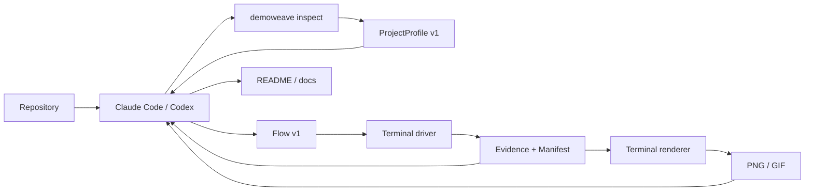

# DemoWeave

**Runtime evidence for agent-authored software documentation.**

DemoWeave helps Claude Code, Codex, and other coding agents ground documentation in verified repository facts and captured runtime behavior. The agent decides what to explain and writes the document; DemoWeave inspects the repository, executes declared workflows, records evidence with provenance, and renders terminal media.


*DemoWeave inspecting DemoWeave: the committed `inspect-project` Flow ran the built CLI, captured terminal evidence, and rendered this GIF. It demonstrates the current evidence pipeline—not automatic README generation.*

## Why DemoWeave

Many AI documentation workflows stop at:

```text
source code → LLM → Markdown
```

DemoWeave adds a verifiable runtime path:

```text
understand → run → capture evidence → render → document
```

The result is a shared workflow in which an agent supplies reasoning and writing while DemoWeave supplies deterministic inspection, execution, evidence, rendering, validation, and provenance.

## What works today

| Capability | Status | Current scope |
|---|---|---|
| Repository analysis | Available | `ProjectProfile v1` with baseline Node, Python, Rust, and Go manifest analysis |
| Multi-surface model | Available | One profile can record multiple components, entrypoints, frameworks, and typed surfaces |
| Terminal workflows | Available | Non-interactive `Flow v1` execution with process runs, waits, assertions, and capture |
| Evidence and provenance | Available | `TerminalTrack v1`, `Evidence v1`, and `Manifest v1` with source and derived relationships |
| Terminal rendering | Available | Headless PNG rendering; GIF rendering when FFmpeg is installed |
| Web, desktop, mobile, notebook, and research execution | Planned | Surface drivers are not implemented yet |
| Automatic Markdown updates and stale tracking | Planned | Roadmap milestones M5 and M6 |
| Composed or narrated tutorials | Planned | Roadmap milestones M8–M10 |

Interactive PTY input, Playwright capture, native desktop/mobile automation, arbitrary GUI screenshots, and complete video/tutorial generation are outside the current implementation.

## How it works



The repository includes a [shared DemoWeave skill](skills/demoweave/SKILL.md) that gives coding agents the same platform-neutral workflow. It is a checked-in agent playbook, not a separately published Claude Code or Codex plugin.

## Quick start

DemoWeave is currently a private pnpm workspace, not a published npm package. Use it from a repository checkout.

Requirements: Node.js 20+, pnpm, and optionally FFmpeg for GIF rendering.

```bash
git clone https://github.com/KingHacker9000/demoweave.git
cd demoweave
pnpm install --frozen-lockfile
pnpm build

node packages/cli/dist/index.js doctor
node packages/cli/dist/index.js inspect .
node packages/cli/dist/index.js validate .
```

`inspect` writes the generated `.demoweave/project.json` profile. `validate` checks the profile, committed Flows, Evidence manifest, and cross-file bindings.

## Run the dogfood workflow

This repository ships the Flow and source evidence used by the animation above:

```bash
node packages/cli/dist/index.js run inspect-project
node packages/cli/dist/index.js render inspect-project-terminal --format png
node packages/cli/dist/index.js render inspect-project-terminal --format gif
node packages/cli/dist/index.js validate .
```

The workflow produces or updates:

- `.demoweave/project.json` — generated repository facts
- `.demoweave/evidence/artifacts/inspect-project-terminal.terminal.json` — renderer-independent terminal capture
- `.demoweave/evidence/manifest.json` — Flow, Evidence, provenance, and derivation records
- `docs-media/inspect-project-terminal.png` and `.gif` — rendered documentation assets

Use `node packages/cli/dist/index.js --help` for the complete command list, including `init`, `status`, `run`, `render`, and `validate`.

## Core concepts

- **ProjectProfile** — deterministic facts about components, ecosystems, manifests, workspaces, entrypoints, commands, docs, and surfaces.
- **Flow** — a surface-neutral sequence of semantic actions. The current terminal driver implements process runs, supported waits and assertions, and terminal capture.
- **Evidence** — a typed artifact record with lifecycle, producer, provenance, and optional derivation metadata.
- **Manifest** — the project index that connects Flows to source and derived Evidence.

The versioned JSON contracts live in [`schemas/`](schemas/).

## Project status

DemoWeave is in active development. M0–M4 established the monorepo, repository analyzer, Flow/Evidence contracts, terminal driver, and PNG/GIF renderer. Pilot P0 is dogfooding that stack on this README; safe Markdown planning is next.

See [ROADMAP.md](ROADMAP.md) for milestone boundaries and future surface drivers. P0 does not mark the Markdown planner, stale regeneration, browser automation, or tutorial composition as shipped.

## Development

```bash
pnpm build
pnpm test
pnpm typecheck
```

CI runs the build, tests, typecheck, CLI workflow, and renderer smoke tests on Ubuntu and Windows.

## License

[MIT](LICENSE)
