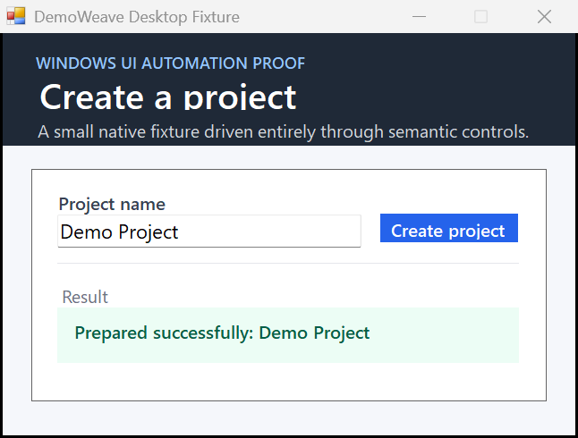

# DemoWeave Windows desktop fixture

This dependency-free WinForms fixture proves the M12B Windows UI Automation backend against a real native application window. It exposes stable AutomationIds for the project-name field, Create button, and result label.



From a native Windows PowerShell session, build and start the fixture:

```powershell
Set-Location C:\path\to\demoweave\fixtures\desktop-windows
.\build.ps1
$fixture = Start-Process .\bin\DesktopWindowsFixture.exe -PassThru
$fixture.Id
```

Then run the built DemoWeave CLI from the repository root with that explicit PID:

```powershell
node packages/cli/dist/index.js inspect fixtures/desktop-windows
node packages/cli/dist/index.js validate fixtures/desktop-windows
node packages/cli/dist/index.js run create-project `
  --project fixtures/desktop-windows `
  --desktop-pid $fixture.Id
node packages/cli/dist/index.js status fixtures/desktop-windows
```

The Flow uses UIA AutomationIds only—no screen coordinates—and captures the attached top-level window rather than the desktop. The PID remains invocation context and is not stored in DemoWeave metadata.
