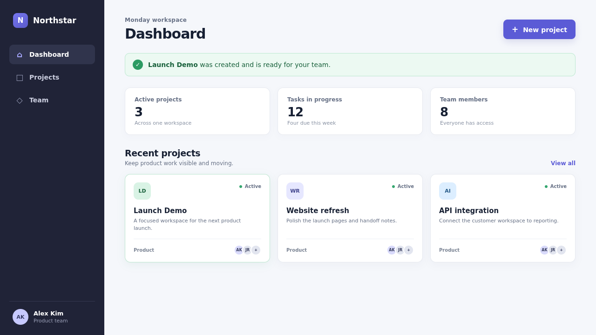

# DemoWeave Web Fixture

A small, deterministic Next.js project used to exercise DemoWeave's semantic web workflow against a real application.

## Evidence



*Captured by DemoWeave's web driver after creating **Launch Demo**.*

## What this proves

- DemoWeave detects the fixture as a Next.js web surface.
- A semantic Flow drives Chromium and captures screenshot Evidence with provenance and fingerprints.
- This README links to the real artifact, so freshness analysis can report document impact when its declared sources change.

## Run it

From `fixtures/web`:

```bash
npm ci
npm run build
npm run start -- --hostname 127.0.0.1 --port 3000
```

Application startup stays separate from DemoWeave Flow execution.

## Capture it

With the fixture running in another terminal and DemoWeave built from the repository root:

```bash
node ../../packages/cli/dist/index.js inspect .
node ../../packages/cli/dist/index.js run create-project --project . --base-url http://127.0.0.1:3000
node ../../packages/cli/dist/index.js validate .
```

The Flow contains semantic interactions and relative navigation only; runtime origin and browser configuration remain invocation-scoped.
